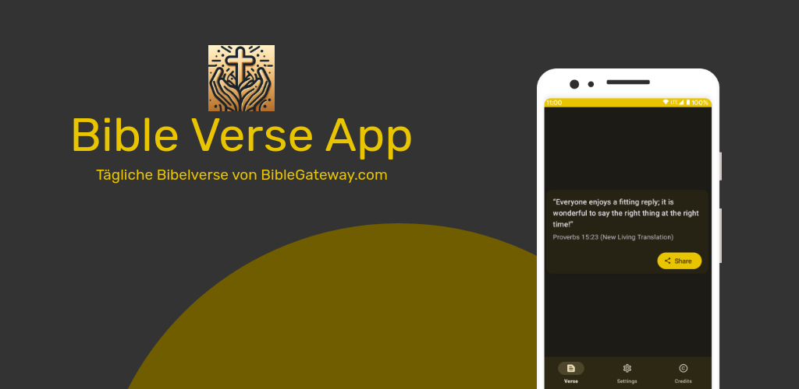

# BibleVerseApp
Die BibleVerseApp bietet täglich inspirierende Bibelverse in verschiedenen Sprachen. 
Mit praktischen Funktionen wie Home-Screen-Widgets, Benachrichtigungen und Teilen können Sie Ihren Glauben lebendig gestalten und täglich von Gottes Wort inspiriert werden. 

 (Bald auch auf F-Droid!)

## Wie erreicht das Projekt die erforderlichen Punktzahl fürs Testat
| Feature                                               | Bewertung      | Verwendet? | Wie?                                                 |
|-------------------------------------------------------|----------------|------------|------------------------------------------------------|
| Verwendung von Kotlin statt Java (pro Teammitglied)   | 3 Punkte       |     ✅     | Kotlin statt Java                                   |
| Funktionalität (pro Funktion / Screen)                | 1 bis 5 Punkte |     ✅     | 3 Screens: Home, Settings, Credits                  |
| Persistenz / Offlinefähigkeit                         | 1 bis 3 Punkte |     ✅     | Room Datenbank, Settings                            |
| Verwendung von Webservices                            | 1 bis 2 Punkte |     ✅     | Bibel API BibleGateway.org                          |
| Verwendung von Notifications                          | 1 bis 2 Punkte |     ✅     | Tages Notification mit Bibelvers                    |
| Verwendung von Aktoren oder Sensoren                  | 1 bis 2 Punkte |     ❌     |                                                     |
| Ressourcen: Lokalisierung                             | 1 bis 2 Punkte |     ✅     | Englisch, Deutsch                                   |
| Ressourcen: Unterschiedliche Layouts pro Gerätetyp    | 1 bis 2 Punkte |     ❌     |                                                     |
| Ressourcen: Unterschiedliche Styles (z.B. Dark-Theme) | 1 bis 2 Punkte |     ✅     | Dark-Theme                                          |
| Verwendung der 2D- und/oder 3D-APIs                   | 1 bis 3 Punkte |     ❌     |                                                     |
| Verwendung von Services, Broadcast Receivers, etc.    | 1 bis 3 Punkte |     ✅     | AlarmManager für Sheduled Notification              |
| Verwendung von Jetpack-Komponenten (pro Typ)          | 1 bis 3 Punkte |     ✅     | AndroidX Preferences für generierung Settingsscreen |
| Integration von Drittkomponenten (Libraries)          | 1 bis 3 Punkte |     ✅     | Einbindung ColorPicker Preferences von 3rd Party    |
| Erstellung eines App Widgets (Home Screen)            | 1 bis 3 Punkte |     ✅     | Widget mit Bibelvers                                |
| Unterstützung einer zusätzlichen Plattform            | 3 bis 5 Punkte |     ❌     |                                                     |
| Deine eigenen Ideen                                   | 1 bis N Punkte |     ✅     |Veröffentlichung im PlayStore und auf Fdroid         | 

Mindestpunktzahl: 14 Punkte

## Screenshots
1. Startseite:
   

2. Einstellungsseite:
  

3. Impressumsseite:
   

4. Widget:
   

5. Notification:
   

